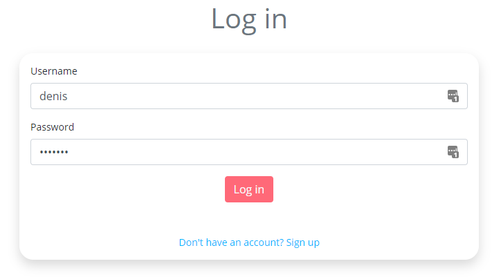
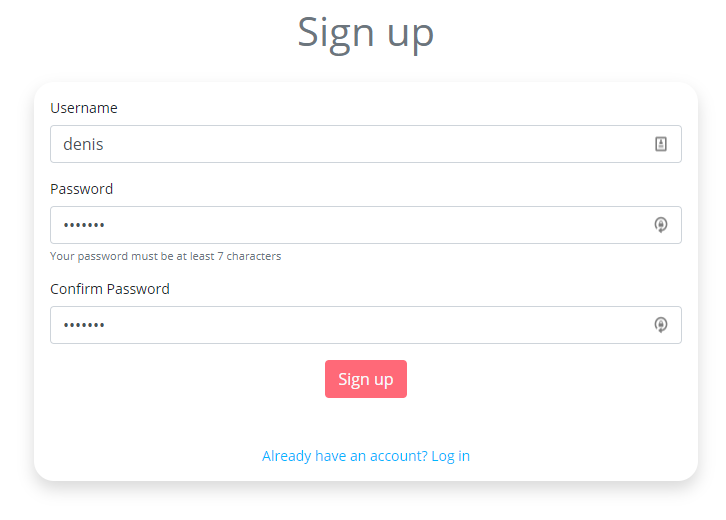
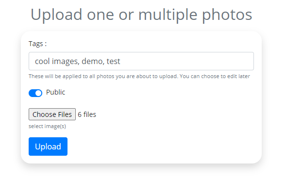
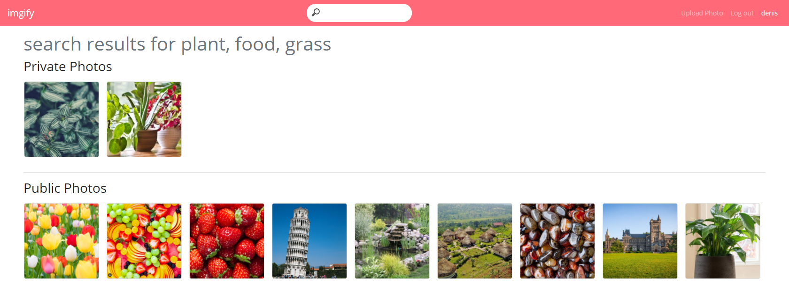
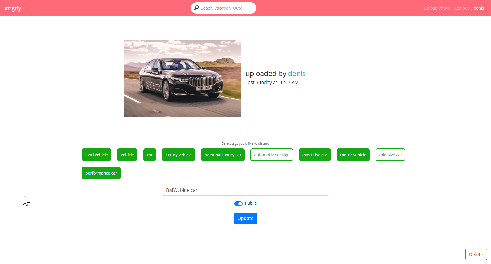

# 
imgify

Imgify is a smart online image repository which let's you store your images and then search for them based on key characteristics.

<h3 align="center">
    <a href="https://imgify.ca">Visit the live app!</a>
</h3>

## Features

### User Accounts
Users are authenticated using [passport.js](http://www.passportjs.org/) and passwords are hashed using [bcrypt](https://www.npmjs.com/package/bcrypt).
You can only upload images if you are logged in, but you can always see images that were set to 'public' by their uploader.

Login Page                 |  Sign Up Page
:-------------------------:|:-------------------------:
  |  

### Uploading Images
Logged in users can upload up to 30 images at once. You could technically upload more, but I've capped it at 30 since at that point it usually takes
about 5-8 seconds to process everything which is slightly inconvenient. Image details and Users are stored on a [mongoDB](https://www.mongodb.com/) database, however the images themselves are stored on an [AWS S3](https://aws.amazon.com/s3/) server.

When an image is uploaded, any tags inputted by the user are supplemented by the [Google Vision API](https://cloud.google.com/vision) which automatically generates labels describing the image.

Here we see 6 images being uploaded, which will be uploaded publically and will all contain the tags listed in the tag box. They will also each be individually processed to have tags generated by Google Vision during the upload stage.

## Search
Users can search by one or more tags to find all public as well as any private images they uploaded that contain those tags. 

Containing at least one tag that was searched for will return the image as a result. Users that are not logged in can still search, but will only see results from public images

## Viewing and Updating
Users can view images that are either public or private but belong to them. Here we see an image uploaded by the logged in user. The user can click on tags to remove them from the image, add new tags and choose whether to change from public to private or vice versa. Users can also delete images they have uploaded.

